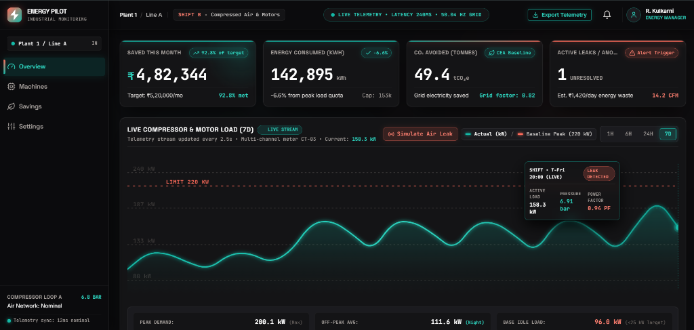
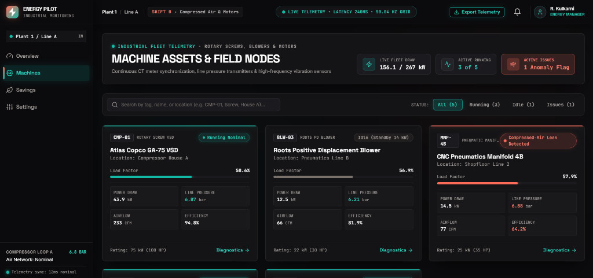
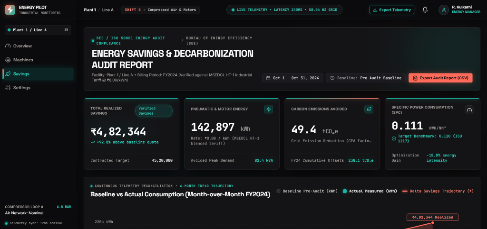
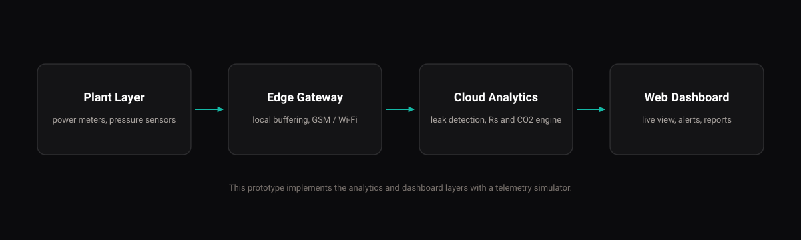

<p align="center">
  
</p>

# Energy Pilot

Real-time compressed-air and motor energy monitoring for Indian MSME factories. Energy Pilot detects air leaks and idle waste as they happen and converts every finding into rupees per day.

Live demo: https://energy-pilot-yuvayodha.vercel.app

## Screenshots

### Overview


### Machines


### Savings Report


## The Problem

A factory's monthly electricity bill shows the total but never the cause. Compressed-air leaks and idle running quietly drain power around the clock, and industrial monitoring systems are built and priced for large plants, not small factories.

## The Solution

Energy Pilot turns raw power and pressure signals into decisions the owner can act on:

1. Sense: low-cost power meters and pressure sensors on compressors and motors.
2. Detect: software spots leaks, idle load and abnormal draw in real time.
3. Quantify: every finding becomes a cost in rupees per day.
4. Prove: a savings report compares actual use against the plant's own baseline.

## Features

- Live load chart for compressors and motors in kW, with 1H, 6H, 24H and 7D windows and a baseline peak line
- Leak and anomaly alerts with estimated rupees per day and per month, plus a dispatch technician action
- Per-machine diagnostics: power, pressure, power factor, flow and status
- Savings report: actual vs baseline in kWh and rupees, with CO2 avoided
- CSV export of telemetry and savings data
- Adjustable tariff, grid emission factor and alert thresholds, saved in the browser, with reset to defaults

## Architecture



## How the Numbers Work

All figures come from one shared simulator, so every page shows consistent values.

| Metric | Formula |
|---|---|
| Energy cost and savings (Rs) | kWh x tariff (Rs per kWh) |
| CO2 avoided (tonnes) | kWh saved x grid emission factor (kg per kWh) / 1000 |
| Leak cost (Rs per day) | Leak CFM x 100 x (tariff / 8.0) |
| Plant load (kW) | Sum of all machines' live kW |

Note: the leak cost model is a modelling assumption for this prototype and not an audited standard. Replace it with measured values in a real deployment.

## Tech Stack

| Area | Technology |
|---|---|
| Frontend | React, TypeScript, Vite |
| Styling | Tailwind CSS |
| Routing | React Router |
| Data | In-browser real-time telemetry simulator |

## Getting Started

```
git clone https://github.com/CodeeSAI/EnergyPilot_yuvayodhatech.git
cd EnergyPilot_yuvayodhatech
npm install
npm run dev
```

The app runs at http://localhost:5173. To create a production build, run npm run build.

## Project Structure

```
src/
  components/   Layout (sidebar, topbar) and shared UI
  pages/        Overview, Machines, Machine Detail, Savings, Settings
  sim/          Telemetry simulator, types and constants
  utils/        CSV export helpers
```

## Roadmap

- 0 to 3 months: finalize the product and sign 2 to 3 pilot MSME factories
- 3 to 9 months: run live pilots and validate savings against each plant's baseline
- 9 to 24 months: expand across industrial clusters and add more machine types

## Disclaimer

All data in this prototype is simulated. Savings and impact figures are modelled targets to be validated in real pilots, not measured results.
